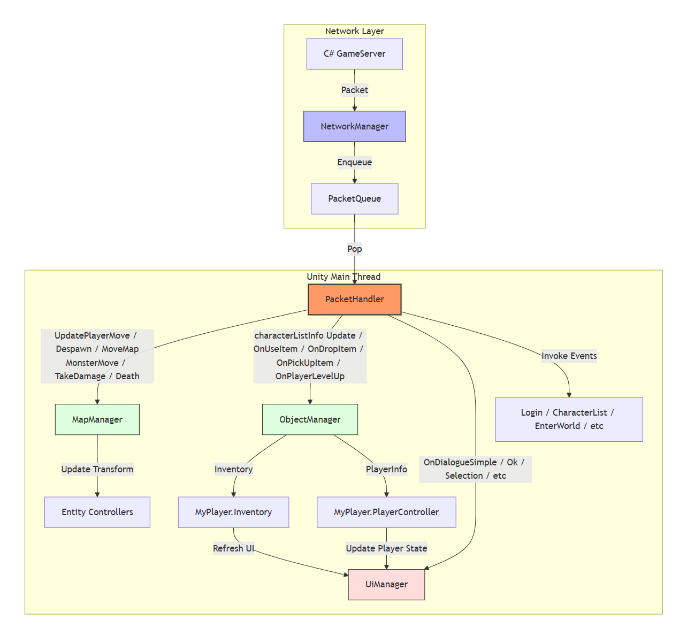
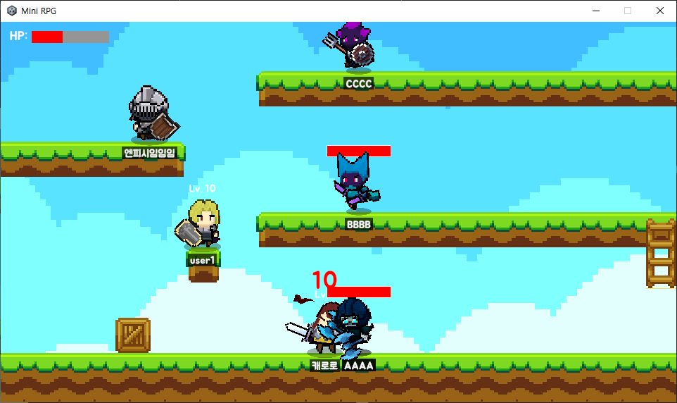

# 🚀 MiniRPG
> **[C# GameServer](https://github.com/devhwan0421/C-_GameServer)의 검증 및 플레이을 위한 유니티 클라이언트**

---

## 1. 프로젝트 소개
- 프로젝트 명: MiniRPG (C# GameServer의 클라이언트)
- 설명: 실시간 멀티플레이 환경에서 서버의 성능과 동기화 로직을 시각화하고 MMORPG의 핵심 컨텐츠를 구현한 유니티 클라이언트

## 2. 핵심 기술 스택
- 게임 엔진: Unity 6000.0.42f1
- 언어: C#
- 네트워크: 비동기 소켓(TCP)
- 사용 에셋: SPUM(캐릭터, 애니메이션)

## 3. 주요 구현 기능
### ⚡실시간 네트워크 동기화
- **비동기 수신 처리:** 서버에서 보내는 패킷을 메인스레드 정지 없이 수신하여 유니티 메인 스레드로 넘겨 처리
- **이동 보간:** 서버의 이동 패킷을 받아 Lerp 보간을 통해 부드러운 캐릭터 이동 구현
- **Packet Handler:** 서버와 일치하는 패킷ID 체계를 유지하며 패킷 처리 로직을 명확하게 분리

### 🎮 MMORPG 콘텐츠 시스템
| 시스템 명칭 | 주요 역할 및 상세 기능 |
| :--- | :--- |
| **엔티티 관리** | 서버로부터 전달받은 **플레이어**, **몬스터** 등의 데이터를 실시간으로 프리팹화하여 생성 및 관리
| **인벤토리** | 아이템 획득, 사용, 바닥에 버리기 등의 상태 동기화 |
| **상호작용 시스템** | **NPC** 대화, **퀘스트** 진행 상태 등을 시각화 |
| **전투 시스템** | 클라이언트 판정 기반의 데미지 표시, 몬스터 사냥 보상 발생 등의 상황을 시각화 및 동기화 |

## 4. 아키텍처 (Architecture)
### 🧱 시스템 구조도
**1. Network Layer (NetworkManager, PacketQueue)**
- TCP 비동기 수신 및 패킷 큐잉을 담당

**2. Dispatch Layer (PacketHandler)**
- 각 도메인으로 분기
- 수신된 패킷 ID를 해석하여 각 매니저의 처리 함수를 호출하거나 이벤트를 처리

**3. Management Layer (MapManager, ObjectManager 등)**
- 게임 월드의 상태 관리자
- 서버의 맵 정보를 바탕으로 오브젝트(Player, Monster, Item 등)를 생성/삭제하고 딕셔너리를 이용해 ID와 클라이언트 GameObject를 매핑

**4. Controller Layer (PlayerController, MonsterController 등)**
- 데이터의 시각화 및 보간. 매니저로부터 전달받은 좌표/상태 데이터를 바탕으로 실제 애니메이션을 실행하고 위치를 이동

**5. UI Layer (UIManager, DialogueUi 등)**
- 서버의 응답에 따른 인벤토리 갱신, 대화 시스템 출력 등 유저 인터페이스를 관리

### 🔄 데이터 흐름도


### 🏗️설계 핵심 원칙
**1. 네트워크 스레드와 유니티 메인 스레드 분리**
- **Why:** 유니티 API는 오직 메인 스레드에서만 호출 가능하므로 네트워크 수신 스레드에서 직접 게임 오브젝트를 조작할 수 없음
- **How:** 수신된 패킷을 즉시 처리하지 않고 `PacketQueue`에 담은 뒤 유니티의 Update 루프에서 꺼내어 처리함으로써 스레드 안정성 확보

**2. 매니저를 통한 오브젝트 제어 효율화**
- **Why:** 수많은 플레이어와 몬스터, 아이템 등이 실시간으로 생성 삭제 되는 상황에서 관리의 어려움을 느낌
- **How:** `MapManager`, `ObjectManager` 등을 싱글톤 매니저로 설계하여 오브젝트 관리, 제어 효율화

**2. 중앙 집중식 매니저를 통한 오브젝트 제어 효율화**
- **Why:** 대규모 멀티플레이 환경에서 수많은 엔티티(플레이어, 몬스터, 드랍 아이템 등)가 실시간으로 생성·삭제되므로, 개별 객체로 로직을 직접 처리하면 복잡하고 객체를 추적하기 매우 어려움
- **How:**
    - **ID 기반 빠른 탐색:** `MapManager` 내부에 `Dictionary<int, GameObject>`를 구축하여 서버가 부여한 고유 ID를 Key로 관리함. 이를 통해 수신된 패킷의 대상 객체를 O(1)의 속도로 즉시 찾아내어 데이터를 업데이트 할 수 있게 함
    - **단일 진입점 확보:** `PacketHandler`는 도메인 세부 로직을 몰라도 매니저의 함수만 호출하면 되도록 설계하여 결합도를 낮추고 로직의 직관성을 높임. 모든 월드 상태 변화는 매니저를 거쳐 일괄적으로 이루어지므로 유지보수도 용이함

### 📂 프로젝트 구조
```text
Assets/Scripts/
├── Common/
│   └── Packet.cs
├── GamePlay/
│   ├── Controller/
│   │   ├── MonsterController.cs
│   │   ├── OtherPlayerController.cs
│   │   └── PlayerController.cs
│   ├── GameData/
│   │   ├── CharacterData.cs
│   │   ├── ItemData.cs
│   │   └── MonsterData.cs
│   ├── InGame/
│   │   ├── Inventory/
│   │   │   └── ItemSlot.cs
│   │   ├── EquipmentInfo.cs
│   │   ├── FieldItem.cs
│   │   ├── Inventory.cs
│   │   ├── Item.cs
│   │   ├── ItemInteraction.cs
│   │   ├── Map.cs
│   │   ├── Monster.cs
│   │   ├── MonsterAttack.cs
│   │   ├── Npc.cs
│   │   ├── NpcInteraction.cs
│   │   ├── Player.cs
│   │   ├── Portal.cs
│   │   ├── Quest.cs
│   │   └── Skill.cs
│   ├── Manager/
│   │   ├── DataManager.cs
│   │   ├── GameManager.cs
│   │   ├── Managers.cs
│   │   ├── MapManager.cs
│   │   ├── ObjectManager.cs
│   │   ├── PoolManager.cs
│   │   ├── ResourceManager.cs
│   │   ├── StateManager.cs
│   │   └── UiManager.cs
│   └── Ui/
│       ├── Dialogue/
│       │   ├── DialogueAcceptDeclineUi.cs
│       │   ├── DialogueNextUi.cs
│       │   ├── DialogueOk.cs
│       │   ├── DialogueSelectionOptionUi.cs
│       │   ├── DialogueSelectionUi.cs
│       │   ├── DialogueSimpleUi.cs
│       │   └── DialogueUi.cs
│       ├── CharacterSelectUi.cs
│       ├── CharacterSlot.cs
│       ├── DamageUi.cs
│       ├── EnterWorldUi.cs
│       ├── InventoryUi.cs
│       ├── LoginTabNavigation.cs
│       ├── LoginUi.cs
│       ├── MainCamera.cs
│       ├── MonsterUi.cs
│       ├── NpcUi.cs
│       ├── PlayerUi.cs
│       ├── SystemUi.cs
│       ├── UI_Base.cs
│       └── UI_EventHandler.cs
├── Network/
│   ├── NetworkManager.cs
│   ├── PacketHandler.cs
│   ├── PacketMaker.cs
│   ├── PacketQueue.cs
│   └── PacketSerializer.cs
├── GroundCheck.cs
└── Ladder.cs
```
## 5. 설계 상세 및 문서
- **[MiniRPG 문서](./MiniRPG-Doc/README.md)**

## 6. 실행 화면


## 🔗 관련 링크
- [C# GameServer](https://github.com/devhwan0421/C-_GameServer)

